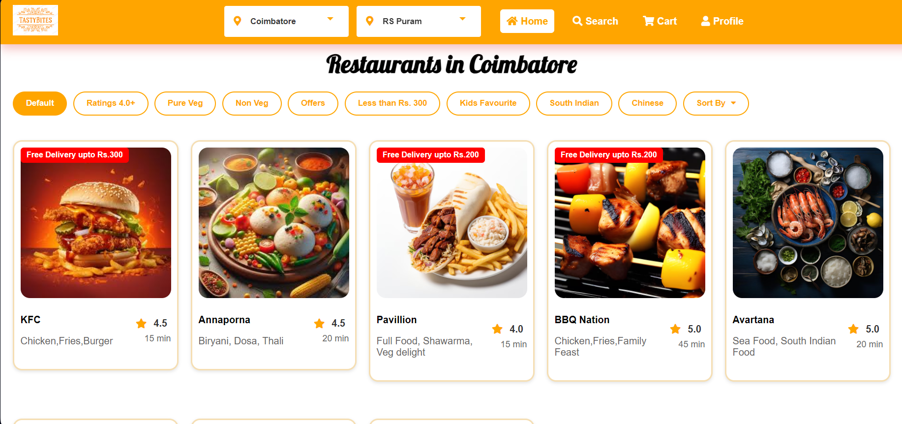

# TastyBites

## Project Overview

This project is a **fully responsive** food delivery website designed to provide users with an optimal experience across various devices. The website allows users to **browse menus**, **place orders**, and manage their profiles in an intuitive and user-friendly way.

---

## Features

1. **Responsive Design**  
   The website is fully responsive, ensuring seamless functionality on various devices, from desktops to mobile phones.

2. **User-Friendly Interface**  
   Comprehensive and easy-to-navigate, allowing users to explore food options, track orders, and update profiles effortlessly.

3. **Multi-City Accessibility**  
   The website supports users from two major cities, offering a wide range of restaurant options based on location.

4. **Account Management**  
   Users can:
   - Sign up
   - Reset passwords through a security question
   - Login
   - View Restaurants and Dishes
   - Place Order
   - Access their order history
   - Edit their profile information

5. **Homepage Features**  
   - Display past orders
   - Browse top restaurants
   - Explore "Must Try" dishes
   - Add items to the cart with detailed descriptions

6. **Restaurant and Cart System**  
   Users can view detailed pages of individual restaurants and dishes. Special combo offers and platters are available. An efficient "add to cart" system is implemented for placing orders.

7. **Placing Orders**  
   After adding items to their cart, users can proceed to place their orders. The website supports a seamless checkout process, allowing users to finalize their food delivery quickly and easily.

---

## Work Flow

- **Sign Up**: New users can create an account and answer security questions for future password recovery.
- **Login**: Returning users can log in with their credentials.
- **Password Recovery**: Users who forget their password can reset it using security questions.
- **Homepage**: Users can explore restaurants, view offers, and add items to their cart.
- **Cart & Checkout**: Users can review their selected items in the cart and place an order through the checkout process.
- **Profile Section**: Users can edit profiles, view order history, and log out.

---

## Screenshots

  ### Homepage
  
  
  ### Restaurant Page
  
  
  
   ### Checkout Page
  
   ### View Orders
  
  

---

## Technologies Used

- **HTML5**: Markup language for structuring the web pages.
- **CSS3**: Styling the user interface for a responsive design.
- **JavaScript**: Interactive elements, like form validation, cart management, and order placement.

---

## Conclusion

In conclusion, i have successfully developed a responsive and user-friendly food delivery website. The website fulfills all the necessary requirements, from browsing to placing orders, and functions seamlessly across devices. It marks a significant milestone in the project , performing as expected.

